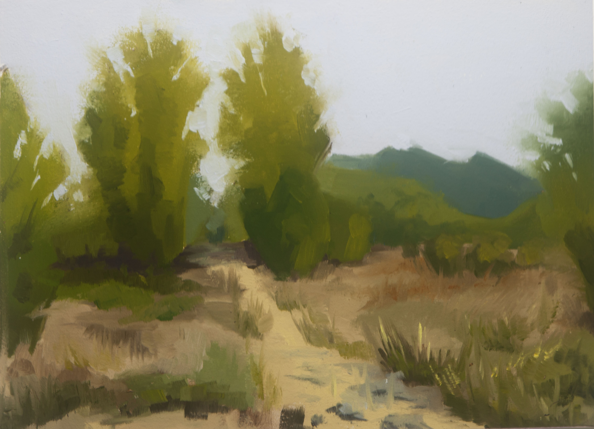

# JHirshman Art Website



## Overview

I built a nextjs application with a firebase backend to proudly display my artwork. 🎨🖼️ 

The application uses Nextjs with tailwind to deliver a responsive user experience and optimized
image delivery - which is important for artwork.  I took full advantage of the nextjs Image component
and the placeholder base64 blur urls.

For now the site is a digital portfolio of my work, although I have plans to add a store where originals
and prints can be purchased.

## Production

Check out the live site at [https://jhirshman.art](https://jhirshman.art).

## Table of Contents

- [JHirshman Art Website](#jhirshman-art-website)
  - [Overview](#overview)
  - [Production](#production)
  - [Table of Contents](#table-of-contents)
  - [Installation](#installation)
  - [Development](#development)
    - [Running Locally](#running-locally)
    - [Building](#building)
  - [Deployment](#deployment)

## Installation

Provide instructions on how to set up your project locally. Include any dependencies or environment variables that need to be configured.

```bash
# Clone the repository
git clone https://github.com/your-username/your-project.git

# Navigate to the project directory
cd your-project

# Install dependencies
npm install
```

You will need to create a Firebase project and configure the environment variables (eg via .env.local)

```
CLIENT_FIREBASE_APIKEY
CLIENT_FIREBASE_AUTHDOMAIN
CLIENT_FIREBASE_DATABASEURL
CLIENT_FIREBASE_PROJECTID
CLIENT_FIREBASE_STORAGEBUCKET
CLIENT_FIREBASE_MESSAGINGSENDERID
CLIENT_FIREBASE_APPID
CLIENT_FIREBASE_MEASUREMENTID
TEST_FIREBASE_DATABASEURL
```

This will point the frontend at the specified firebase application so you can host artwork to display.

## Development

### Running Locally

To run the nextjs application locally and test out the basic functionality, do
```
npm run dev
```
which will allocate a port and serve the nextjs application in development mode.

### Building

To build the application run
```
npm run build
```
This will kick off the nextjs build system which will report which components are generated as Static, Server Side Rendered, and Client


## Deployment

The project is automatically deployed to Vercel at https://jhirshman.art whenever changes are pushed to the main branch.